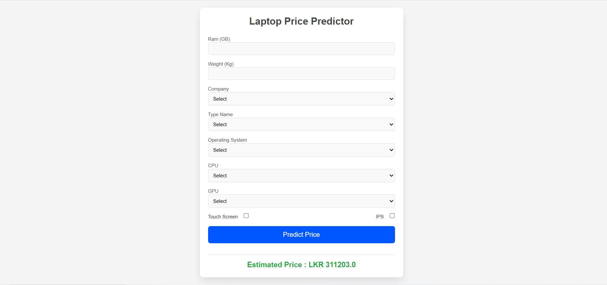

# Laptop Price Prediction Web App

This is a Flask-based machine learning web application that predicts laptop prices based on given specifications. The model is trained using a dataset of laptops, and predictions are made using a RandomForestRegressor.

---

---

## Features
- Predict laptop prices based on user input.
- Flask backend for handling requests.
- Machine Learning Model trained using Scikit-learn.
- Preprocessing Pipeline to ensure consistency between training and prediction data.
- Interactive Web Interface for input and result display.

## Model Training
- The dataset is preprocessed using Pandas and Scikit-learn.
- Categorical features are one-hot encoded.
- The RandomForestRegressor model is trained on the dataset.
- The trained model is saved and used for predictions.
